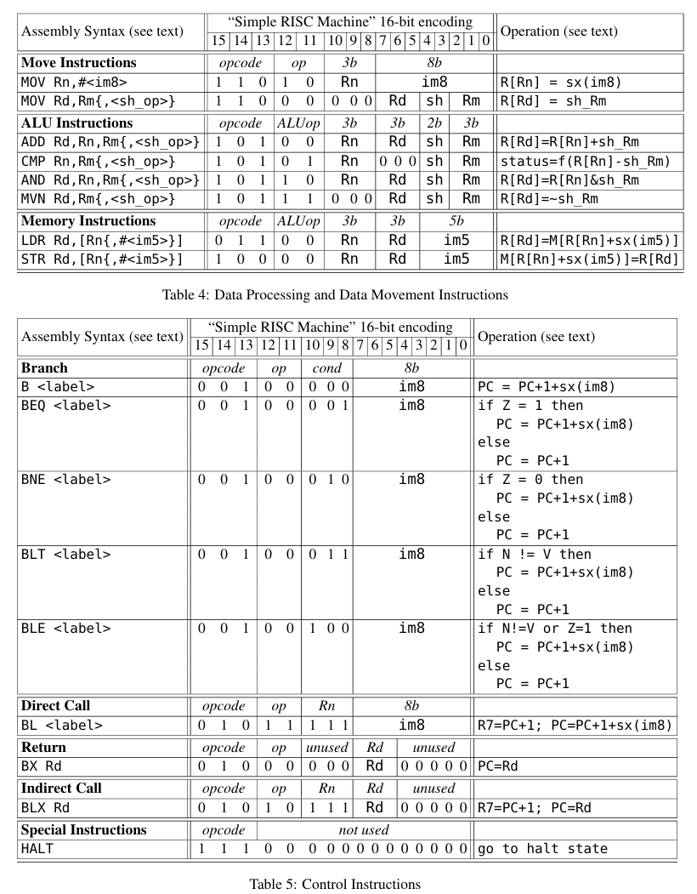

# RISC-V Processor

This repository contains an implementation of a modified RISC-V processor in SystemVerilog. The project includes both RTL (Register-Transfer Level) and gate-level verification to ensure the processor's functionality and performance.

## Features
- **Processor Architecture**: Implements the RISC-V instruction set.
- **Verification**: Includes RTL and gate-level verification for robust testing.
- **SystemVerilog**: Designed entirely in SystemVerilog for hardware description.

## Repository Structure
- `assembler/`: Contains the assembler source code and related files.
- `db/`: Includes database files for synthesis and simulation.
- `incremental_db/`: Stores incremental database files.
- `output_files/`: Contains output files generated during the build process.
- `project_files/`: Project configuration files.
- `src/`: Source files for the processor implementation.
- `tb/`: Testbench files for verification.
- `work/`: Working directory for intermediate files.

## Instruction Set

